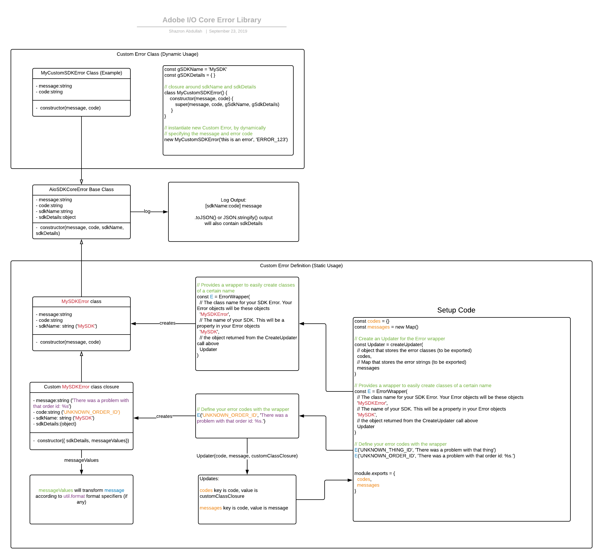

<!--
Copyright 2019 Adobe. All rights reserved.
This file is licensed to you under the Apache License, Version 2.0 (the "License");
you may not use this file except in compliance with the License. You may obtain a copy
of the License at http://www.apache.org/licenses/LICENSE-2.0
Unless required by applicable law or agreed to in writing, software distributed under
the License is distributed on an "AS IS" BASIS, WITHOUT WARRANTIES OR REPRESENTATIONS
OF ANY KIND, either express or implied. See the License for the specific language
governing permissions and limitations under the License.
-->
# aio-lib-core-errors

[](https://npmjs.org/package/@adobe/aio-lib-core-errors)
[](https://npmjs.org/package/@adobe/aio-lib-core-errors)
[](https://github.com/adobe/aio-lib-core-errors/actions/workflows/node.js.yml)
[](https://opensource.org/licenses/Apache-2.0) 
[](https://codecov.io/gh/adobe/aio-lib-core-errors/)


This contains the base class for all Adobe I/O Core Errors. Use this as an Error class subclass for all your SDK Errors.

This module was inspired by how Node.js creates its own Error classes.

## Install

`npm install @adobe/aio-lib-core-errors`

## Architecture

[](./media/architecture.png)

## AioCoreSDKError

This is the base class for all the Error classes, and it should not be instantiated directly. Create your own subclass (dynamic usage) or use the ErrorWrapper below (static usage).

The `message` property of `AioCoreSDKError` outputs the Error in this format:
```bash
[SDK:ERROR_CODE] ERROR_MESSAGE
```
- `SDK` is the SDK name
- `ERROR_CODE` is the error code
- `ERROR_MESSAGE` is the error message

Note that the `sdk details` is not displayed in the message. To see any `sdk details`, you will need to convert the Error object itself to JSON via `.toJSON()` (`JSON.stringify` will convert the Error object as well, via invoking `.toJSON()` on the Error object)

## Dynamic Errors Usage

```javascript
// Adobe I/O Campaign Standard Wrapper

const { AioCoreSDKError } = require('@adobe/aio-lib-errors')

const gSDKDetails = {
  // ... add your sdk details here
  tenantId,
  endpoint
}
const gSDKName = "AdobeIOCampaignStandard"

export default class CampaignStandardCoreAPIError extends AioCoreSDKError {
  constructor(message, code) {
    // the sdk name and sdk details are curried in as the 3rd and 4th parameters
    super(message, code, gSDKName, gSDKDetails)
  }
}
```

So if we have this wrapper function, we change from:
```javascript
function getAllProfiles (parameters) {
    return new Promise((resolve, reject) => {
      const apiFunc = 'getAllProfiles'
      this.sdk.apis.profile[apiFunc]()
        .then(response => {
          resolve(response)
        })
        .catch(err => {
          debug(err)
          // >>>>>TO CHANGE<<<<<<<<<
          reject(new Error(`${apiFunc} ${err}`))
        })
    })
  }
```

to this:
```javascript
function getAllProfiles (parameters) {
    return new Promise((resolve, reject) => {
      const apiFunc = 'getAllProfiles'
      this.sdk.apis.profile[apiFunc]()
        .then(response => {
          resolve(response)
        })
        .catch(err => {
          debug(err)
          // >>>>>NEW<<<<<<<<<
          reject(new CampaignStandardCoreAPIError(err.message /* error message */, apiFunc /* error code */))
        })
    })
}
```

As you can see, this is not very intuitive, and may be error-prone. We can do better with static errors (see below).

## Static Errors

The example Usage above is for dynamic errors, for example API errors that we are wrapping. Static errors are much better: they are more intuitive to use, and much better for code readability.


### 1. Create your Error Class via the ErrorWrapper

We define our specialized Error class, and error codes in its own module like so:
```javascript
// SDKErrors.js
const { ErrorWrapper, createUpdater } = require('@adobe/aio-lib-core-errors').AioCoreSDKErrorWrapper

const codes = {}
const messages = new Map()

/**
 * Create an Updater for the Error wrapper
 */
const Updater = createUpdater(
  // object that stores the error classes (to be exported)
  codes,
  // Map that stores the error strings (to be exported)
  messages
)

/**
 * Provides a wrapper to easily create classes of a certain name, and values
 */
const E = ErrorWrapper(
  // The class name for your SDK Error. Your Error objects will be these objects
  'MySDKError',
  // The name of your SDK. This will be a property in your Error objects
  'MySDK',
  // the object returned from the CreateUpdater call above
  Updater
  // the base class that your Error class is extending. AioCoreSDKError is the default
  /* , AioCoreSDKError */
)

module.exports = {
  codes,
  messages
}

// Define your error codes with the wrapper
E('UNKNOWN_THING_ID', 'There was a problem with that thing')
E('UNKNOWN_ORDER_ID', 'There was a problem with that order id: %s.')
```

#### Error Class Wrapper

Let's parse what this line means:
```javascript
E('UNKNOWN_ORDER_ID', 'There was a problem with that order id: %s.')
```

This will dynamically create a `MySDKError` class with the appropriate closures for values:
- sdk name (`MySDK`, passed in to the ErrorWrapper constructor above)
- sdk error class name (`MySDKError`, passed in to the ErrorWrapper constructor above)
- error code (`UNKNOWN_ORDER_ID`, the first parameter passed in to `E`)
- error message (`There was a problem with that order id: %s.`, the second parameter passed in to `E`. If this is a string with `format specifiers`, you can pass in arguments for the format specifiers, when the Error is constructed. See example below).
```javascript
class MySDKError extends AioCoreSDKError { ... }
```

The line will add the dynamically created `MySDKError` class to the exported `codes` object, with the first parameter to the wrapper (the error code) as the key.

The `constructor` for the class created takes one parameter, an object:
```javascript
constructor(parameters)
```
- `parameters` (optional) is an `object`
- `parameters.sdkDetails` (optional) is an `object` that you want to pass in as additional data for the Error object. e.g. function parameters for an API call.
- `parameters.messageValues` (optional) is a `string`, `number`, `object` or an `array` of the items that you want to apply to the error message, if the message has a [format specifier](https://nodejs.org/api/util.html#util_util_format_format_args).

In the error specification line below, you can see it has one format specifier `%s`:
```javascript
E('UNKNOWN_ORDER_ID', 'There was a problem with that order id: %s.')
```

### 2. Use Your Error Classes

Import the static error code Error classes, and use directly.
```javascript
 const { UNKNOWN_THING_ID, UNKNOWN_ORDER_ID } = require('./SDKErrors').codes
// or, if you have too many codes to destructure:
// const { codes } = require('./SDKErrors')

const gSdkDetails = {
  tenantId: 'mytenant'
}
// convoluted examples, but demonstrates usage
const unknownThing = true
if (unknownThing) {
  throw new UNKNOWN_THING_ID({ sdkDetails: gSDKDetails })
}

const unknownOrderId = true
if (unknownOrderId) {
  // messageValues can either be a string, object, etc or an array of them
  throw new UNKNOWN_ORDER_ID({ 
    sdkDetails: gSDKDetails,
    messageValues: ['ORDER-2125SFG']
  }) ) 
}

function getOrder(orderId) {
  // we just wrap the function arguments as the sdkDetails
  const sdkDetails = { orderId }
  const somethingWentWrong = true

  if (somethingWentWrong) {
  // messageValues can either be a string, object, etc or an array of them
    throw new UNKNOWN_ORDER_ID({ 
      sdkDetails: sDKDetails,
      messageValues: 'ORDER-2125SFGF'
    }) ) 
  }
}

getOrder('abc123')
```

## Example Console Output
---
Print out a thrown `UNKNOWN_ORDER_ID` Error object to the console. `console` calls the `.toString()` method for the Error object, and the resulting data is not structured well, and will not expand nested objects:
```javascript
try {
  throw new UNKNOWN_ORDER_ID()
} catch (e) {
  console.error(e)
}
```
Output:
```bash
 { MySDKError: [MySDK:UNKNOWN_ORDER_ID] There was a problem with that order id: ORDER-21241-FSFS.
          at new <anonymous> (/Users/obfuscated/aio-lib-core-errors/src/AioCoreSDKErrorWrapper.js:22:9)
          at Object.<anonymous>.test (/Users/obfuscated/aio-lib-core-errors/test/MySDKError.test.js:50:15)
          at Object.asyncJestTest (/Users/obfuscated/aio-lib-core-errors/node_modules/jest-jasmine2/build/jasmineAsyncInstall.js:102:37)
          at resolve (/Users/obfuscated/aio-lib-core-errors/node_modules/jest-jasmine2/build/queueRunner.js:43:12)
          at new Promise (<anonymous>)
          at mapper (/Users/obfuscated/aio-lib-core-errors/node_modules/jest-jasmine2/build/queueRunner.js:26:19)
          at promise.then (/Users/obfuscated/aio-lib-core-errors/node_modules/jest-jasmine2/build/queueRunner.js:73:41)
          at process._tickCallback (internal/process/next_tick.js:68:7)
        code: 'UNKNOWN_ORDER_ID',
        sdk: 'MySDK',
        sdkDetails: { tenantId: 'MYTENANT2' },
        name: 'MySDKError' }
```
---
Simply print out a thrown `UNKNOWN_ORDER_ID` Error object's `message` property to the console:
```javascript
try {
  throw new UNKNOWN_ORDER_ID()
} catch (e) {
  console.error(e.message)
}
```
Output:
```bash
[MySDK:UNKNOWN_ORDER_ID] There was a problem with that order id: ORDER-21241-FSFS.
```
---
Convert a thrown `UNKNOWN_ORDER_ID` Error object to JSON and print to the console. `console` calls the `.toJSON()` method of the Error object, and will expand nested objects:
```javascript
try {
  throw new UNKNOWN_ORDER_ID()
} catch (e) {
  console.error(JSON.stringify(e, null, 2))
}
```
Output:
```json
{
	"sdk": "MySDK",
	"sdkDetails": { "tenantId": "MYTENANT2" },
	"code": "UNKNOWN_ORDER_ID",
	"message": "[MySDK:UNKNOWN_ORDER_ID] There was a problem with that order id: ORDER-21241-FSFS.",
	"stacktrace": "MySDKError: [MySDK:UNKNOWN_ORDER_ID] There was a problem with that order id: ORDER-21241-FSFS.\n    at new <anonymous> (/Users/obfuscated/aio-lib-core-errors/src/AioCoreSDKErrorWrapper.js:22:9)\n    at Object.<anonymous>.test (/Users/obfuscated/aio-lib-core-errors/test/MySDKError.test.js:50:15)\n    at Object.asyncJestTest (/Users/obfuscated/aio-lib-core-errors/node_modules/jest-jasmine2/build/jasmineAsyncInstall.js:102:37)\n    at resolve (/Users/obfuscated/aio-lib-core-errors/node_modules/jest-jasmine2/build/queueRunner.js:43:12)\n    at new Promise (<anonymous>)\n    at mapper (/Users/obfuscated/aio-lib-core-errors/node_modules/jest-jasmine2/build/queueRunner.js:26:19)\n    at promise.then (/Users/obfuscated/aio-lib-core-errors/node_modules/jest-jasmine2/build/queueRunner.js:73:41)\n    at process._tickCallback (internal/process/next_tick.js:68:7)"
}
```

## Explore

`goto` [API](./doc/api.md)

## Contributing

Contributions are welcomed! Read the [Contributing Guide](./.github/CONTRIBUTING.md) for more information.

## Licensing

This project is licensed under the Apache V2 License. See [LICENSE](LICENSE) for more information.
